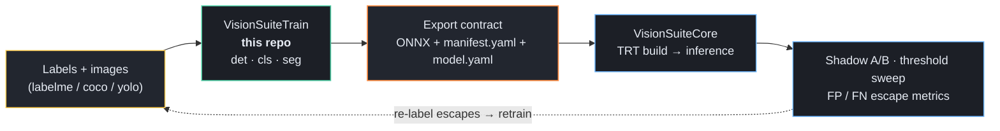
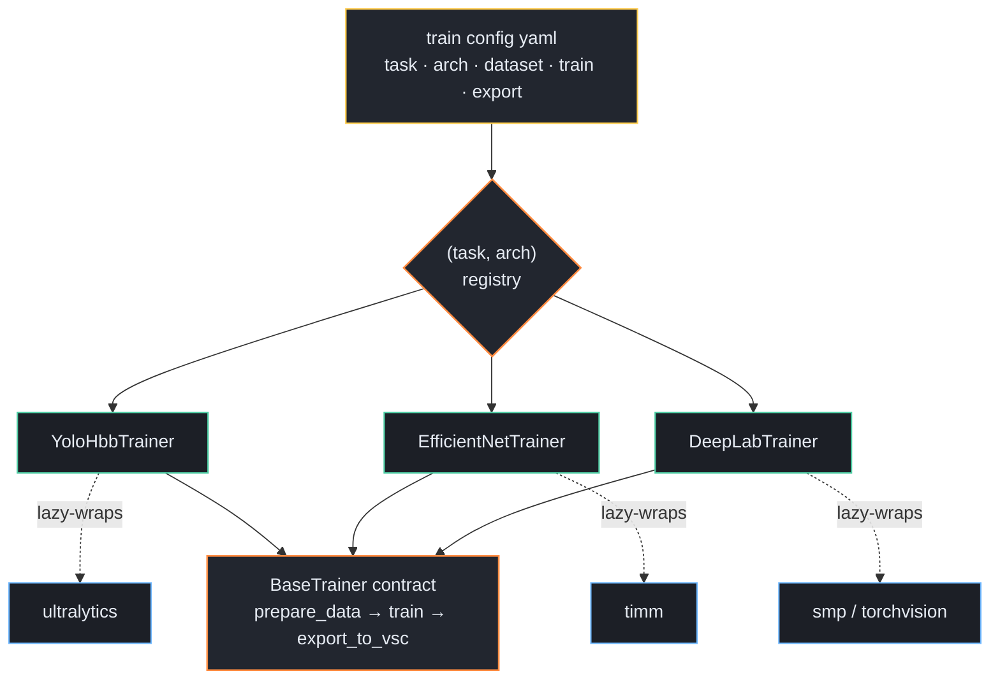
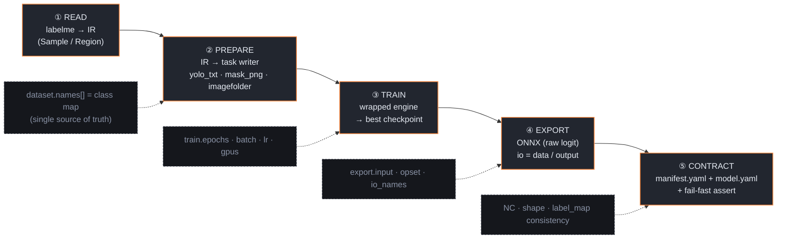
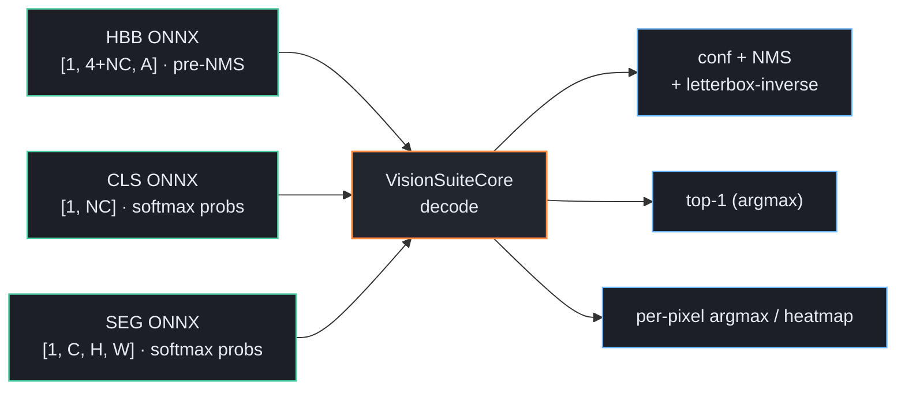

# VisionSuiteTrain

**Unified training core** — train detection / classification / segmentation from
**one config**, and export to the exact **ONNX + manifest contract** that
[**VisionSuiteCore**](https://github.com/CVKim/VisionSuiteCore) consumes for
TensorRT inference. One repo, many architectures, a single export contract.

> VisionSuiteTrain is the **producer**; VisionSuiteCore is the **consumer**.
> They are not linked by code — they are linked by an **export contract**
> (ONNX tensor layout + `manifest.yaml`). Train in Python/PyTorch, deploy in
> C++/TensorRT, with no shared runtime.

---

## 1.  Where it fits — the MLOps loop



The training side owns **what the model is**; the runtime side owns **how it is
deployed**. The contract in the middle is the only thing both sides must agree on.

---

## 2.  Architecture — `(task, arch)` adapter registry

VisionSuiteTrain does **not reimplement** trainers. Each `(task, arch)` pair maps
to a thin **adapter** that wraps a mature engine (ultralytics / timm / smp) behind
one 3-method contract. Adding an architecture = add one adapter, not a framework.



Heavy engines are **lazy-imported inside adapter methods**, so the package
imports — and the whole config / data / export layer is testable — with **zero**
GPU or training dependencies installed.

---

## 3.  The per-run pipeline (5 steps)

Every run, regardless of task, flows through the same five steps. Each dashed box
is a yaml-controllable knob.



`dataset.names[]` (0-based, order = label id) is the **single source of truth**
for class mapping — readers, writers, ONNX channel count, and `manifest.label_map`
all derive from it, and the exporter asserts they agree before writing.

---

## 4.  The export contract — one shape family, decode lives in the runtime

Detectors export **decoded boxes + sigmoid scores, pre-NMS** (the runtime owns NMS);
classifiers and segmenters **bake softmax into the graph** (output = probabilities),
matching the reference training core's real exports. This keeps v7/v8/D-FINE/RF-DETR
on a single runtime handler and the contract faithful to production.



| Task | ONNX output | Coords / values | Runtime decode (VSC) |
|---|---|---|---|
| HBB detection | `[1, 4+NC, A]` | `cxcywh` in **input px**, `value_range [0, H]` | per-class conf → NMS → letterbox-inverse |
| Classification | `[1, NC]` | **softmax probs** `[0, 1]` | top-1 (argmax) |
| Segmentation | `[1, C, H, W]` | **per-pixel softmax probs** `[0, 1]` | argmax / per-channel heatmap (bg = channel 0) |

- **HBB**: exported with `nms=False` so the runtime owns conf + NMS. `A` = number
  of anchor/grid predictions; `NC` = number of classes.
- **CLS**: **softmax baked into the graph** (reference-core faithful) → output is
  class probabilities `[0,1]`; the runtime takes top-1.
- **SEG**: **softmax(dim=1) baked** → per-pixel class probabilities; `manifest.yaml`
  declares `activation: softmax` + `background_index` as descriptive metadata, and the
  runtime takes per-pixel argmax (or a per-channel heatmap).

> **Verified against production exports.** The `manifest.yaml` schema
> (`environment / inputs / outputs / preprocessing / task`), int-keyed
> `label_map`, input `value_range [0, 255]`, detection output `value_range [0, H]`,
> and the SEG output `axes → {activation, background_index}` block were all
> cross-checked byte-for-byte against real exported models (opset 17, CUDA 12.8,
> onnx 1.18). The exporter reproduces that schema exactly.

---

## 5.  Supported architectures

| Task | arch (config) | wrapped engine | ONNX contract | VSC handler |
|---|---|---|---|---|
| HBB detection | `yolov8_hbb`, `yolov7_hbb` | ultralytics YOLO | `[1, 4+NC, A]` | `yolov8_hbb` |
| OBB detection | `yolov8_obb`, `yolov11_obb` | ultralytics YOLO-OBB | `[1, 4+NC+1, A]` (angle last) | `yolov8_obb` |
| Classification | `efficientnet`, `classifier` | timm | `[1, NC]` softmax | `efficientnet` |
| Segmentation | `deeplab3pp`, `deeplab3pp_one_channel` | smp (DeepLabV3+) / torchvision | `[1, C, H, W]` softmax | `deeplab3pp` |
| Anomaly | `foundation_anomaly` | recon-AE (1st pass) | `[1, 1, H, W]` heatmap `[0,1]` | `foundation_anomaly` |
| **(roadmap)** detection | `dfine_hbb`, `rfdetr_hbb` | D-FINE / RF-DETR | `[1, 4+NC, A]` (A=queries)† | `yolov8_hbb` (unified)† |
| **(roadmap)** ocr | `paddleocr` | PaddleOCR det+rec+cls | DB map / CTC / angle | (db / parseq) |

† **Verified against real production exports.** D-FINE `[1, 16, 300]` and RF-DETR
`[1, 27, 300]` already emit the **unified `[1, 4+NC, A]` channel-first layout**
(A = 300 queries instead of anchors, `value_range [0, H]`) — so they decode through
the **existing `yolov8_hbb` handler with no new VisionSuiteCore handler**. The
2nd-scope work is only the *training adapter* (wrapping the D-FINE / RF-DETR repos);
the data pipeline (`labelme` HBB) and the export contract are identical to YOLO.

---

## 6.  Config cheat sheet

One YAML fully specifies a run. `arch ↔ task` consistency, `${run.name}`
substitution, and `names` uniqueness are validated at load time (fail-fast).

```yaml
run:   { name: demo_hbb, seed: 42, out_dir: ./runs/${run.name} }

task: hbbdetection                 # hbbdetection | classification | segmentation
arch: yolov8_hbb                   # see table above
arch_variant: { size: m }          # adapter-specific free dict

dataset:
  format: labelme                  # labelme reader → IR → task writer
  root: ./_local_data/det          # images + *.json (gitignored)
  names: [scratch, dent, stain]    # 0-based class map = single source of truth
  split: { ratio: { train: 0.8, val: 0.1, test: 0.1 } }

train:
  epochs: 100
  batch: 16
  imgsz: 640
  optimizer: adamw                 # adamw | sgd
  lr: 1.0e-3
  weight_decay: 5.0e-4
  amp: true
  gpus: [0]                        # multi-GPU: [0,1,2,3]
  workers: 8

export:
  io_names: { input: data, output: output }   # VSC contract names
  input:    { w: 640, h: 640, c: 3, value_range: [0.0, 255.0] }
  opset: 17
  dynamic_axes: false
  backend: trt
  fp16: true
  preprocess_carry:                # carried into manifest / model.yaml
    resize_mode: letterbox         # det: letterbox · cls/seg: resize
    normalize: true
    rgb: true
  # cls-only:  cls_activation: softmax
  # seg-only:  seg_background_class: 0 · seg_mode: multi_channel | one_channel
```

Three ready samples ship in [`configs/train/`](configs/train):
`yolov8_hbb.yaml`, `efficientnet.yaml`, `deeplab3pp.yaml`.

---

## 7.  Usage

```bash
# install core (no training engine needed for config / data / export work)
pip install -e .

# add only the engine you need (each is an optional-deps group, lazy-imported)
pip install -e ".[yolo]"     # ultralytics      → detection
pip install -e ".[cls]"      # timm             → classification
pip install -e ".[seg]"      # smp              → segmentation
pip install -e ".[export]"   # onnx, onnxslim   → ONNX introspection
pip install -e ".[dev]"      # pytest

vstrain list                                       # registered (task, arch) adapters
vstrain check    -c configs/train/yolov8_hbb.yaml  # schema + adapter mapping
vstrain validate -c configs/train/yolov8_hbb.yaml  # dataset integrity (no training)
vstrain train    -c configs/train/yolov8_hbb.yaml  # prepare → train → export
vstrain export   -c configs/train/yolov8_hbb.yaml --ckpt runs/demo_hbb/train/weights/best.pt

# or train from a named preset + runtime data injection (no full config file):
vstrain presets                                                 # list bundled presets
vstrain train --preset hbb_speed   --root ./data/det --names scratch,dent,stain
vstrain train --preset cls_default --root ./data/cls --names ok,ng --out ./runs/exp1
```

`train` writes `runs/<name>/model.onnx`, `runs/<name>/<name>_manifest.yaml`, and
`runs/<name>/model.yaml` — drop that folder into VisionSuiteCore's `configs/models`
and it infers.

**Presets** (`visionsuitetrain/presets/{train,test,export}/*.yaml`) are *sparse,
dataset-agnostic* configs — model / hyperparameters / augmentation / export only —
that the runtime fills onto schema defaults and into which `--root`/`--names` are
injected at train time (clean-room adoption of the reference training core's preset mechanism).
Bundled train presets: `hbb_speed`, `hbb_accuracy`, `cls_default`, `seg_default`.

---

## 8.  Repository layout

```
configs/train/*.yaml            one yaml per (task, arch)
src/visionsuitetrain/
  config/  schema.py            TrainConfig (pydantic v2) + load/validate
           canonical.py         task/arch enums, aliases, arch→model.type
  registry.py                   (task, arch) → BaseTrainer  (@register_trainer)
  data/    ir.py                Sample / Region intermediate representation
           readers/labelme.py   labelme json → IR
           writers/             yolo_txt · mask_png · imagefolder (pure-core)
           validate.py split.py integrity check + train/val/test split
  export/  onnx_io.py           io rename (data/output) + output-shape introspect
           manifest.py          manifest.yaml builder (talos-compatible schema)
           model_yaml.py        VSC model.yaml (deployment) builder
           base_exporter.py     VscExporter — write + fail-fast consistency assert
  trainers/base.py              BaseTrainer ABC (3-method contract)
           yolo_hbb.py efficientnet.py deeplab.py
  cli.py                        vstrain entry point
tests/                          pure-core tests (no GPU / heavy libs)
docs/ARCHITECTURE.md
```

---

## 9.  Design principles

- **Contract over coupling.** Train (Python/PyTorch) and runtime (C++/TensorRT)
  share no code — only the ONNX layout + `manifest.yaml`. Either side can be
  swapped as long as the contract holds.
- **Wrap, don't reimplement.** ultralytics / timm / smp are mature; the value
  added here is the **unified config schema** and the **unified export contract**,
  not another training framework.
- **`names[]` is law.** One class list drives readers, writers, ONNX channels,
  and `label_map`; the exporter refuses to write if they disagree.
- **Lazy, testable core.** Engines import only inside the method that runs them,
  so CI / schema / data-pipeline tests need no GPU. `pytest` is green with nothing
  but numpy / cv2 / pydantic / pyyaml installed.
- **Fail-fast export.** `VscExporter.assert_consistency` blocks an export whose
  NC, input shape, opset, or label_map would later fault the runtime loader.

---

## 10.  Branches & authorship

- Branch flow: **`master`** (stable) · **`dev`** (integration) · **`feat/*`**
  (work) → verify → merge.
- Never commit company codenames, models, weights (`*.onnx` / `*.pt` / `*.trt`),
  or images — all gitignored; local-only material uses the `_local_` prefix.

Maintained by **Gwangyeol Kim**. See `git log` for history.

> Status: scaffold complete (det / cls / seg adapters, config + registry, labelme
> data pipeline, contract-faithful exporter, CLI, pure-core test suite). See
> [`docs/ARCHITECTURE.md`](docs/ARCHITECTURE.md) for the full design.
